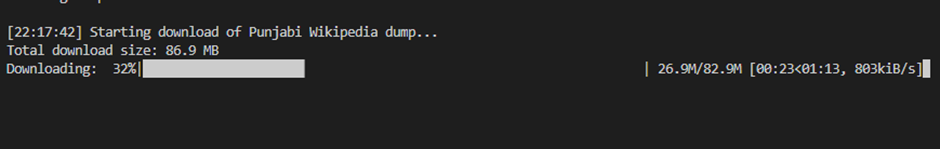
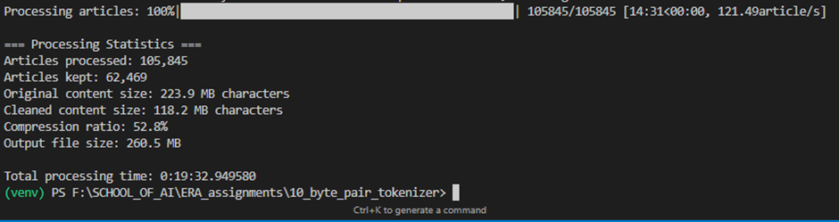
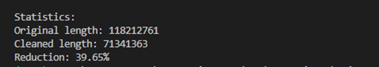
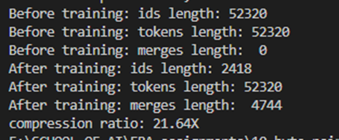
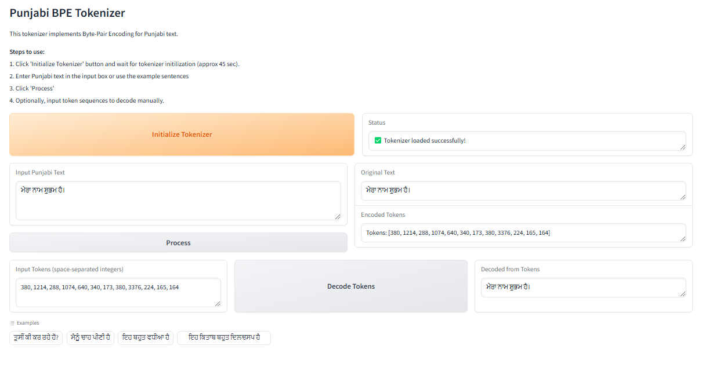

# Punjabi BPE Tokenizer

This repository contains a Byte-Pair Encoding (BPE) tokenizer specifically designed for Punjabi text. 

## Features

- Custom BPE implementation for Punjabi
- Vocabulary size < 5000 tokens
- Compression ratio > 3.2X
- Gradio web interface for easy interaction
- Support for encoding and decoding Punjabi text

## Setup

1. Activate virtual environment
``` 
python -m venv venv 
.\venv\Scripts\Activate
```

2. Install requirements
```
pip install -r requirements.txt
```

3. Download and extract the punjabi language courpus from wiki dumps. 



```
python download_wiki_dumps.py
python extracting_dumps.py
```

4. Clean the extracted corpus


```
python clean_corpus.py
```

5. Make sure you have a Punjabi corpus file named `pa_corpus_cleaned.txt` in the root directory

6. Testing the tokenizer model locally 


```
python model.py
```
7. Gradio interface


```
python app_gradio.py
```

## Usage

The Gradio interface will start and be accessible at `http://localhost:7860`

## Deployment

This app is also deployed to Hugging Face Spaces:

## TO UPDATE LATER 

## Note

The sample size parameter in the tokenizer has been optimized to achieve the required compression ratio of >3.2X. You can adjust this parameter in the `initialize_tokenizer()` function if needed.

## Explantion of algorithm:
1. Byte-level encoding:
- The code encodes the text into bytes using UTF-8 encoding.
- Each Unicode character in Punjabi (or any other language) is represented by one or more bytes.
  
2. Initial vocabulary:
- The initial vocabulary contains all possible byte values (0-255).
- This means it can represent any character in any language, including Punjabi.
  
3. BPE process:
- The BPE algorithm then merges frequent byte pairs into new tokens.
- These merged tokens will represent common patterns in Punjabi text.

4. Handling Unicode characters:
- For multi-byte Unicode characters (which includes most non-ASCII characters like those in Punjabi), the initial splits will be between bytes rather than between characters.
- As the algorithm progresses, it will learn to merge these bytes back together into meaningful units.

For example:

-  Punjabi character like ਪ (U+0A2A) is represented as three bytes in UTF-8: b'\xe0\xa8\xb0'
- Initially, these might be treated as separate tokens
- As training progresses, the algorithm would likely merge these into a single token representing the full character
